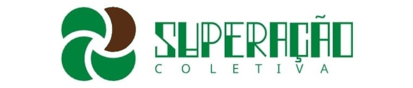
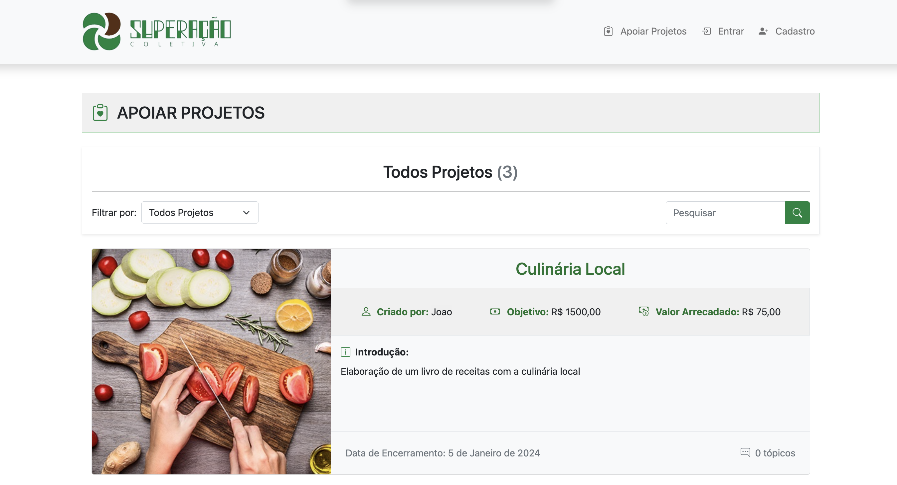

<h1 align="center"></h1>

<h1 align="center">
    
</h1>

[](LICENSE)
<h1 align="center">
    Plataforma Tecnológica de Financiamento Coletivo de Projetos Inovadores das Mulheres de Brumadinho
    <br>
    SuperAÇÃO Coletiva
</h1>

O projeto Plataforma Tecnológica de Financiamento Coletivo de Projetos Inovadores das Mulheres de Brumadinho SuperAÇÃO Coletiva faz parte da chamada pública [CGI.br/NIC.br/Ceweb.br nº 01/2019
Mover-Se na Web – Articulação Pró-Brumadinho](https://ceweb.br/projetos/chamada.html)

#  Descrição da solução

<div align="center">



</div>
<br>


O projeto SuperAÇÃO Coletiva consiste em uma plataforma de financiamento coletivo com recursos sociais colaborativos, que tem o objetivo de promover o financiamento coletivo de projetos das mulheres de Brumadinho.

Neste repositório você tem acesso ao código completo do MVP (Minimum Viable Product - Produto Mínimo Viável) da plataforma, com as principais funcionalidades de um sistema de financiamento coletivo com recursos de discussão social e API de pagamentos implementadas.

<a target="_blank" href="github_media/tutorial_de_uso.pdf">📖 Manual de uso do MVP</a>

<br>

## Motivação

Coletivos de mulheres têm se organizado para se apoiarem e desenvolverem projetos para ajudar Brumadinho. Devido à complexidade inerente ao planejamento e gestão de projetos, muitas ideias boas não atingem todo o seu potencial.

Por falta de conhecimento de como executar, buscar recursos e de comunicação organizada, muitas ideias interessantes não são sequer avaliadas e se perdem oportunidades valiosas.Mesmo com ótimas ideias, podem faltar também condições concretas de execução de projetos como apoio financeiro, gestão e logística.

SuperAÇÃO Coletiva é um protótipo de plataforma digital que tem por finalidade cadastrar projetos inovadores das mulheres de Brumadinho, visando buscar propostas de financiamento coletivo e suporte para o planejamento e a execução de tais projetos.

<div align="center">



</div>


### Funcionalidades desenvolvidas

- [x] Cadastro de Usuário
- [x] Criação de projeto
- [x] Fórum de discussão de projeto (espaço de interação social)
- [x] Contribuir com projeto (doação)
- [x] Gestão dos projetos
- [x] Responsividade / PWA
- [x] Recursos de acessibilidade
- [x] API de pagamento integrada (via sandbox)


#  Instalação

### Tecnologias utilizadas

*   [Django](https://www.djangoproject.com/)
*   [PWA](https://developers.google.com/web/progressive-web-apps)
*   [Bootstrap](https://getbootstrap.com/)
*   [API Mercado Pago | Developers - Checkout Pro](https://www.mercadopago.com.br/developers/pt/docs/checkout-pro/landing)
*   [AWS S3](https://aws.amazon.com/s3/)

### Pré-requisitos

*   [Python](https://www.python.org/) (recomendado versão 3.10)
*   [Git](https://git-scm.com/)
*   É necessário uma conta no [Mercado Pago | Developers](https://www.mercadopago.com.br/developers/pt) para a utilização do API Mercado Pago | Developers - Checkout Pro nos pagamentos.
*   É necessário também de conta no [AWS S3](https://aws.amazon.com/s3/), caso deseje utilizá-lo para armazenar os arquivos de mídia.

### 1. No terminal

```
# Clone o repositório
$ git clone https://github.com/AiltonGabriel/superacao-coletiva

# Acesse a pasta do projeto
$ cd superacao-coletiva

# Instale as dependências
$ pip install -r requirements.txt

# Crie o banco de dados
$ python manage.py makemigrations 
$ python manage.py migrate

# Crie o usuário administrador
$ python manage.py createsuperuser

# Colete os arquivos estáticos
$ python manage.py collectstatic
```

### 2. Configuração das variáveis de ambientes

Abra o arquivo arquivo [.env](superacao_coletiva/.env), localizado em superacao_coletiva/.env, e configure as variáveis de ambiente.

**Observação:** A variável de ambiente USE\_AWS\_S3 define se os arquivos de mídia serão salvos no AWS S3 ou localmente. Caso seja marcada como False eles serão salvos localmente e não há necessidade de preencher as outras variáveis relacionadas a credenciais do AWS S3.

### 3. Executando a aplicação

#### Utilizando o servidor de desenvolvimento do Django

Execute a aplicação utilizando o servidor de desenvolvimento do Django como o seguinte comando:

```
# Para que a aplicação fique disponível em: http://localhost:8000
$ python manage.py runserver

# Para executar a aplicação em uma porta específica:
$ python manage.py runserver <PORTA>

# Para que a aplicação fique disponível externamente:
$ python manage.py runserver 0:<PORTA>
```

**Observação:** Este servidor não é recomendado para produção. Veja mais informações na [documentação do Django](https://docs.djangoproject.com/en/3.2/ref/django-admin/#runserver). 


#### Utilizando o Gunicorn (Recomendado):

Execute em um sistema Linux utilizando [Gunicorn](https://gunicorn.org/)  com os comandos:

```
# Para desenvolvimento:
$ gunicorn -c config/gunicorn/dev.py

#Para produção:
$ gunicorn -c config/gunicorn/prod.py

# Aplicação ficará disponível na porta:8000.
```


</br>

#### Solução de problemas

*   Para que o status dos pagamentos seja atualizado é necessário configurar para que o webhook da API do Mercado Pago | Developers envie as atualizações para <SEU_DOMINIO>/projects/donation/webhook/. Caso não tenha um domínio ou esteja executando localmente, sugerimos o uso do [ngrok](https://ngrok.com/).
    
*   Lembre-se de que para utilizar o AWS S3 é necessário configurar as credenciais de acesso.
    
*   Por favor, verifique a documentação oficial das tecnologias utilizadas para mais informações sobre configuração, uso e problemas comuns.


<br/>

### Equipe responsável pelo projeto 

- [Cheilon Caldeira Camargo](https://github.com/anaelbr) - IF Sudeste MG, Campus Barbacena (Coordenador)
- [Rafael José de Alencar Almeida](https://github.com/rafjaa) - IF Sudeste MG, Campus Barbacena (Orientador)
- [Ailton Gabriel de Oliveira](https://github.com/AiltonGabriel)           - IF Sudeste MG, Campus Barbacena (Desenvolvedor)
- [Vinicius Augusto da Silva Paulo](https://github.com/)      - IF Sudeste MG, Campus Barbacena (Desenvolvedor)
- Luciano Polisseni Duque      - IF Sudeste MG, Campus Juiz de Fora (Consultor)

</br>


# Sobre o [Ceweb.br](https://ceweb.br/sobre-o-ceweb-br/), [NIC.br](https://www.nic.br/sobre/) e [CGI.br](https://cgi.br/sobre/)

### Ceweb.br - Centro de Estudos sobre Tecnologias Web
O Centro de Estudos sobre Tecnologias Web (Ceweb.br) foi criado como um departamento do Núcleo de Informação e Coordenação do Ponto BR (NIC.br) para viabilizar a participação da comunidade brasileira no desenvolvimento global da Web e subsidiar a formulação de políticas públicas. O Ceweb.br nasce inspirado pelos princípios e projetos já desenvolvidos pelo Escritório Brasileiro do W3C (World Wide Web Consortium), hospedado e apoiado pelo NIC.br no Brasil desde 2008, com a missão de promover atividades que estimulem o uso de tecnologias abertas e padronizadas na Web.


### NIC.br - Núcleo de Informação e Comunicação do Ponto BR
O Núcleo de Informação e Coordenação do Ponto BR - NIC.br foi criado para implementar as decisões e os projetos do Comitê Gestor da Internet no Brasil - CGI.br, que é o responsável por coordenar e integrar as iniciativas e serviços da Internet no País.


### CGI.br - Comitê Gestor da Internet no Brasil
O Comitê Gestor da Internet no Brasil tem a atribuição de estabelecer diretrizes estratégicas relacionadas ao uso e desenvolvimento da Internet no Brasil e diretrizes para a execução do registro de Nomes de Domínio, alocação de Endereço IP (Internet Protocol) e administração pertinente ao Domínio de Primeiro Nível ".br". Também promove estudos e recomenda procedimentos para a segurança da Internet e propõe programas de pesquisa e desenvolvimento que permitam a manutenção do nível de qualidade técnica e inovação no uso da Internet

### Equipe Ceweb.br

<ul>
    <li>Amanda Marques</li> 
    <li>Ana Eliza</li>
    <li>Beatriz Rocha</li>
    <li>Caroline Burle</li>
    <li>Diego Cerqueira</li>
    <li>Diogo Cortiz</li>
    <li>Juliana Ribeiro</li>
    <li>Reinaldo Ferraz</li>
    <li>Selma de Morais</li>
    <li>Vagner Diniz</li>
</ul>
